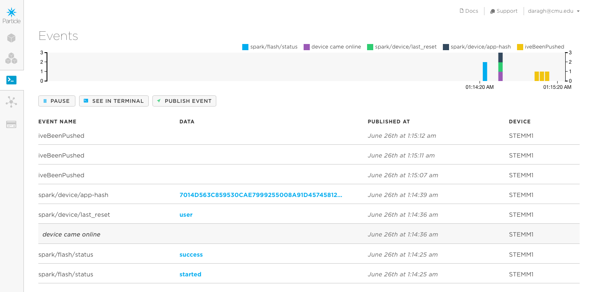

# Step 4: Adding Internet

It'd be really useful to know what value our potentiometer is giving, right? 

One of the best things about the Photon is that it's connected to the internet. And it let's you put this kind of information from your device online, really really quickly. It lets you see what's happening on your device, make readings and other values available in just a line of code! You can connect all sort of actions and fuctions of your device online too. 

We're going to look at how to make some of this information visible in this section! 

## Circuit

There's no changes to our circuit this time! 

## Code

Use the code from Step 3 as a starting point for this sketch. The [completed code](code-by-end/LED.ino) is available in the folder above.

### Making your variables visible

We're going to start by making our `ledBrightness` and `potReading` variables from the last example available to view online. 

It really is as simple as one line of code. 

In the setup just add this line

```Particle.variable("dial", potReading );```

to make the potentiometer reading visible online... and 

```  Particle.variable("brightness", ledBrightness);```

to make the LED brightness visible online too. 

Once you've made those changes,  __save and flash your code__ (hit the lighting!)

To view these variables in real time, you can do that from Particle Dev. Choose the `Particle` Menu (top right) and then select `Show Cloud Variables`. A new panel will open and after a few moments you should see something like this:


Try changing your potentiometer readings and refreshing the values. 

### Making Announcements with `Particle.publish`

The Particle Cloud let’s us do lots of awesome things like put variables from our microcontroller online quickly. It also let’s us pass useful messages to devices that are interested in hearing what our microcontroller’s got to say. It does this through it’s events. Events are mini messages that other devices can listen out for. As you share (or publish an event), those devices that are listening are notified and can do stuff with the information. Think of them as a Twitter for devices

Again it only takes one line of code to publish an event

````Particle.publish( eventName, data ); ````

This line is like my device saying: __‘Pst, I’ve got something you might want to know’__

Let's add in an event to our code.... 

Copy and paste the push button code from Stage 2 into our loop and let's make one quick change

````    int buttonState = digitalRead( buttonPin );

    if( buttonState == LOW )
    {
     // turn the LED On
     digitalWrite( ledPin, HIGH);
    }

````

Let's change the digitalWrite to a publish and have our device announce when the button is pushed.

````    int buttonState = digitalRead( buttonPin );

    if( buttonState == LOW )
    {
     // turn the LED On
     Particle.publish( "iveBeenPushed" );
    }

````

Once you've made those changes, __save and flash your code__ (hit the lighting!)

Then you'll need to open the Particle console at [http://console.particle.io](http://console.particle.io). If you log in with the information on the handout you'll be able to see all the events from devices (and it'll be up on screen too!) Once you're signed in, navigate to the events tab (left hand icon) 

Then push the button!!! And you should see something like this!




