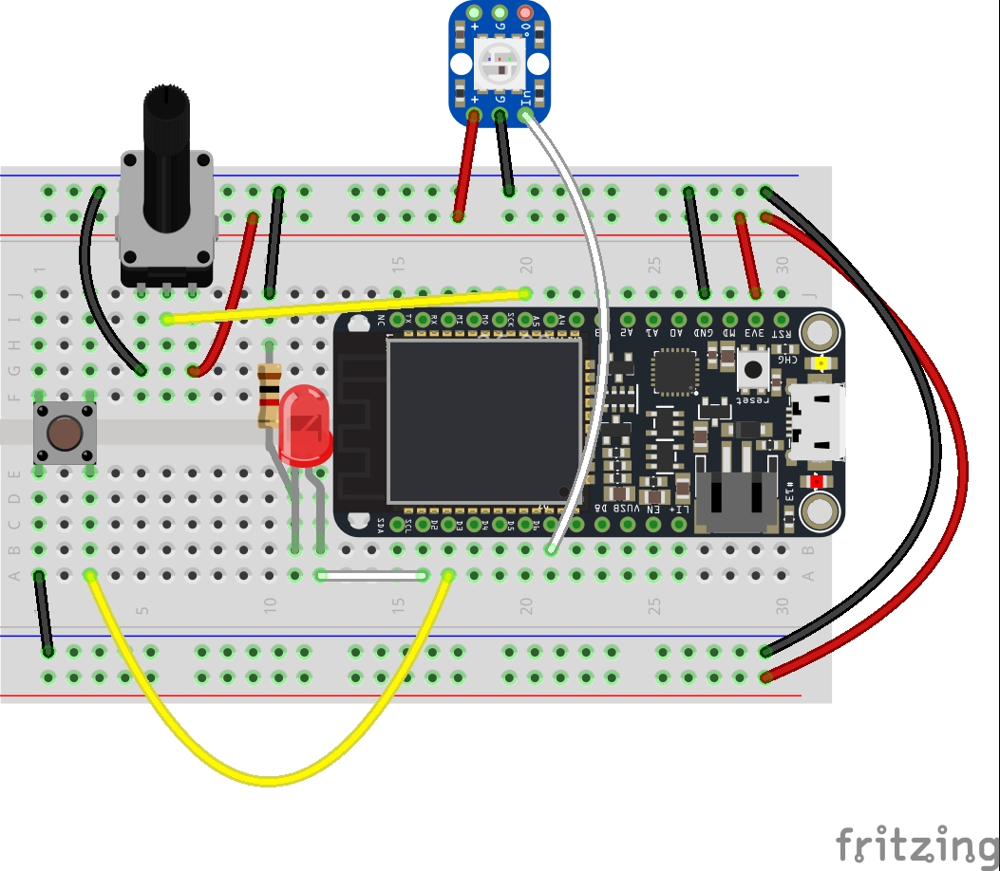

# Step 5: Controlling color 

We've covered all the basics and got the core of our circuit built. Now it's time to start making our connected product: an ambient weather visualisation. 

Right now, we've got an LED in our circuit. But its only a single color and that's not ideal. 

The good news is it's pretty easy to add RGB leds to our circuit. We're going to use Adafruit's [Neopixel](https://learn.adafruit.com/adafruit-neopixel-uberguide/the-magic-of-neopixels) (there's [one included in your kit](https://www.adafruit.com/product/1312)) We're going to use this _full color LED_ as the main feedback for our ambient viz! 

Oh and you might have wondered about the __ping-pong ball in your kits__. Try popping it over the LED on your Argon - you'll find it diffuses the light really nicely. 


## RGB LEDs

An ordinary LED has one light emitting component, _RGB LEDs have three_ - one which emits __red__ light (R) , one for __green__ light (G) and one for __blue__ (B). It works much like a pixel on your computer screen these three components combine to give us color. We can control their brightness separately to mix colors. For example, by turning on the Red and Green component we can yellow light while turning on the red and blue components we can get magenta. 


## Wiring a NeoPixel RGB LED


Neopixels require 3 pins for control: one for power (+, 3V3), one for ground (-, GND) and one signal or input. This `IN` should be wired to one of your digital Pins. 

There are three additional pins on your breadboard friendly neopixel. These allow them to be chained to another neopixel. For this project you won't need to wire it up.

Note: On the Argon, Boron and Xenon, only these pins can be used for Neopixel:

- D2, D3, A4, A5
- D4, D6, D7, D8
- A0, A1, A2, A3

In addition on the Argon/Boron/Xenon, only one pin per group can be used at a time. So it's OK to have one Adafruit_NeoPixel instance on pin D2 and another one on pin A2, but it's not possible to have one on pin A0 and another one on pin A1.


## RGB LED Circuit

Make some changes to the circuit and add in the RGB LED: 



## Library

Many many times when we write code to make a project or a component work, someone out there has already figured it out. From talking to sensors to interacting with complex components like screens or LED strips, libraries allow the community of developers to package their code up and share it. Once shared, you can quickly and easily import it into your project and benefit from their hardwork. 

Formally, libraries are shared, reusable and verified code packages that allow you to quickly add project or component specific functionality to your project.

For Arduino and Particle there are thousands of available libraries. You can read more about [them here](https://docs.particle.io/tutorials/device-os/libraries/).

Neopixels work because they have their own chip that addresses each pixel in an LED strip and allows you to independently control each one. But they also have a single wire (`IN`) to control them. _How does this work?_ Simply put they use a communication protocol like `WS2812` or  `WS2812B`. The Neopixel library makes it easy to control them because it wraps the functionality to properly and appropriately use a pin on your microcontroller to deliver instructions to them.

In this case, we're  going to use the [Neopixel](https://github.com/technobly/Particle-NeoPixel) library for Particle. 

First we need to import this into our project. You'll do this by clicking the _Bookmark_ icon. This will open a list of available libraries that you can search. Enter the word `Neopixel` and it'll filter down. 


Choose the Neopixel library and you'll be brought to a summary screen. Click the `Include in Project` option and follow the prompts


Once added you should see the following line at the top of your project. This will import the library, it's functionality and make it available to your project. 

````
#include <neopixel.h>
````


## Code


Use the  code from Step 4 as a starting point for this sketch. The [completed code](code-by-end/LED.ino) is available in the folder above.

We'll start by adding three variables to the top of our code for each R,G and B component; also add some variables to store the current RGB values;

````
int redValue = 255; // Full brightness for an ANODE RGB LED is 0, and off 255
int greenValue = 255; // Full brightness for an ANODE RGB LED is 0, and off 255
int blueValue = 255; // Full brightness for an ANODE RGB LED is 0, and off 255</td>
````

You'll also need to add some code to set up the library 

```
// IMPORTANT: Set pixel COUNT, PIN and TYPE
#define PIXEL_COUNT 1
#define PIXEL_PIN D7
#define PIXEL_TYPE WS2812B
Adafruit_NeoPixel strip(PIXEL_COUNT, PIXEL_PIN, PIXEL_TYPE);
```

In the `setup()` initialize the neopixel library

````
  // Set up our NEOPIXEL RGB Pin pins for output
  strip.begin();
	
````

Then, start with an empty loop like so

````
void loop(){

}
````
__Note__ You might need to delete the existing loop because you can't have two in the same sketch!

Then add a simple function to set the RGB Values

````
void setRGBColor( int r, int g, int b ){
  redValue = r;
  greenValue = g;
  blueValue = b;

  strip.setPixelColor(0, redValue, greenValue, blueValue);
  strip.show();

}
````

Now, modify the loop and experiment with making colors with our RGB LED. Add this to your loop

````
    setRGBColor( 255,255,255);    // set it to white
		delay( 2000);						// wait 2 seconds
    setRGBColor( 255,0,0);    // set it to red
		delay( 2000);						// wait 2 seconds
    setRGBColor( 255,255,0);    // set it to yellow
		delay( 2000);						// wait 2 seconds
    setRGBColor( 255,127,0);    // set it to orange
		delay( 2000);						// wait 2 seconds
    setRGBColor( 255,0,255);    // set it to magenta
		delay( 2000);						// wait 2 seconds
    setRGBColor( 0,255,0);    // set it to green
		delay( 2000);						// wait 2 seconds
    setRGBColor( 0,255,0);    // set it to green
		delay( 2000);						// wait 2 seconds
````

Once you've made those changes, __save and flash your code__ (hit the lighting!) Don't forget to pop on your ping pong ball!


### Try it yourself

Experiment with these colors - they can be any where from 0 - 255 for each component. Try out a few variations 


