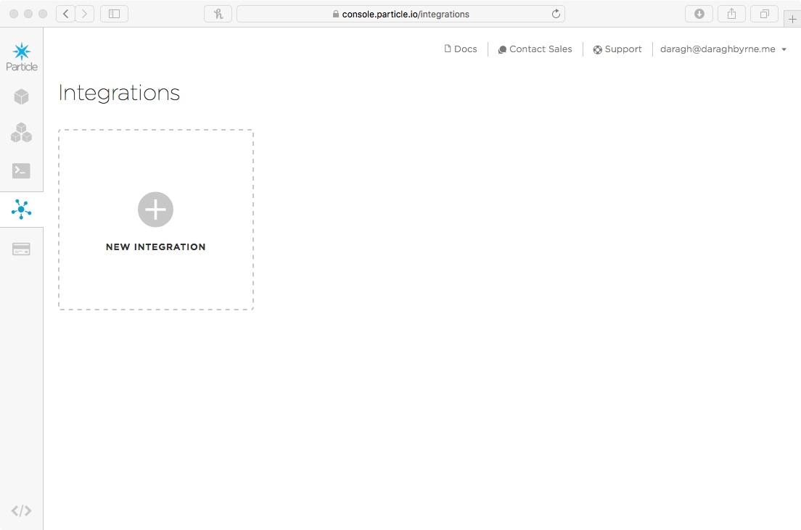
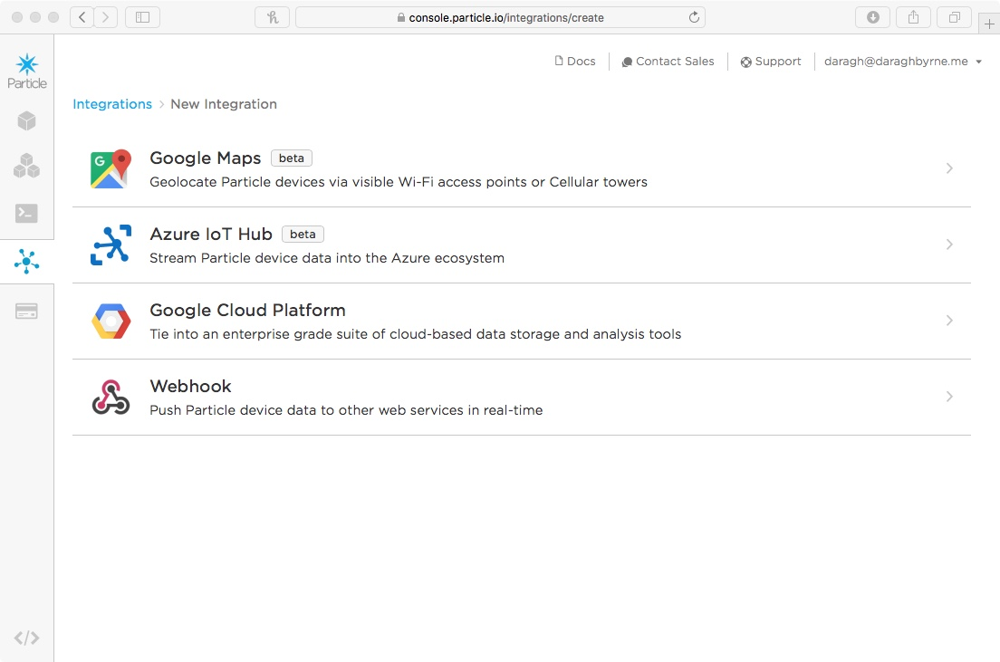
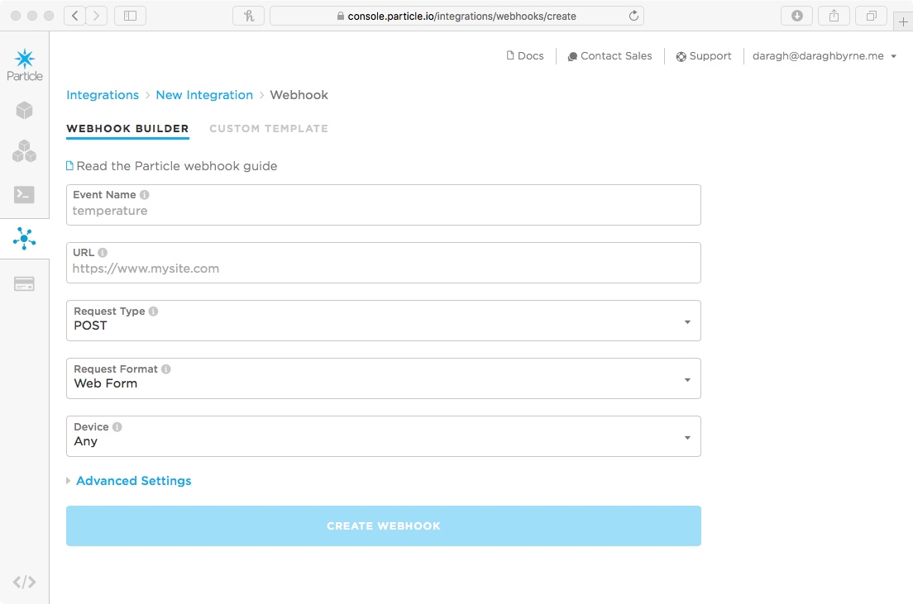
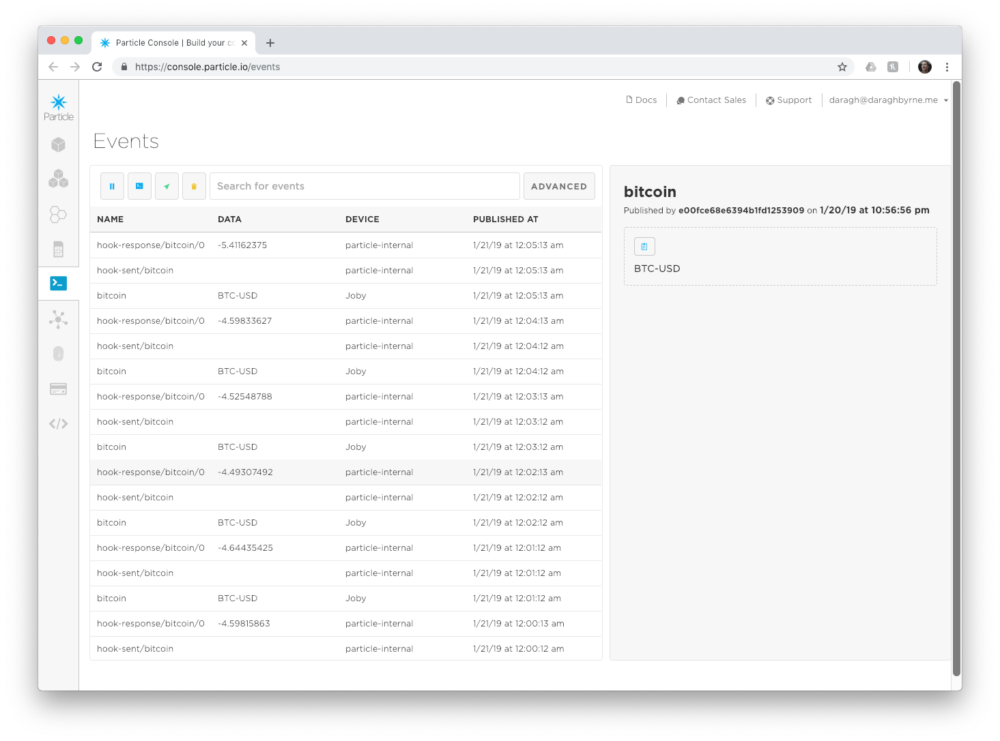

# Step 6: Ambient Bitcoin

All the pieces are in place. We just need to bring them together...

But first, how do we know the weather? 

Particle allows us to make requests for bits of information from online sources by using something called "Webhooks". When the Argon wants to find out come info from an online service (the weather, how many emails you have, if a stock price is up or down, etc.), the Argon can trigger a request to that service. The Particle Cloud manages the request to that source and returns it to the Argon.

The way webhooks work is as follows:

1. Each webhook has a unique name and maps to some piece of information that's found online
1. When your Argon wants some information from a webhook. And when it does it'll publish an event. That event will have the same name as the webhook. e.g. If I have a webhook called 'get-news-articles' then I'd send an event with the same name (Particle.publish('get-news-articles'))
2. The webhook will be triggered and it'll go off and find the bit of information we're looking for
3. When it's found it, it publishes a new event called 'hook-response/webhookname' that my decive is listening for. This event has the info we want in it.
4. My device gets the info and can do cool stuff. 

Before the workshop, I set up a webhook you can use. It's called `bitcoin`. It gets information from [cryptonator](https://www.cryptonator.com/api) - an online platform that specializes in bitcoin currency pricing. Perfect! 

The webhook asks for one bit of information - the currency you want to get exchange and pricing information - and it sends back four things:

- Base - Base currency code
- Target - Target currency code
- Price - Volume-weighted price
- Volume - Total trade volume for the last 24 hours
- Change - Past hour price change

We're going to add these into our code and have it look up bitcoin pricing

### Starting point.

Let's start fresh after all those experiments. You might want to [copy and paste from this starting point](code-at-start/LED.ino) or create a new project using this code. As always the finished code for this step is in [the folder ](code-by-end/LED.ino) or create a new project using this code.


### Setting up your webhook

Go to the [Particle Console](https://console.particle.io/devices) and sign in. On the left hand side there's a small icon bar, you'll find an option for 'Integrations'. 



Click it and choose the option to add a new integration. You'll get four options like this. Choose the webhook.



You'll then be asked to add the info for your webhook. 



Add the following: 

- Event Name: `bitcoin`
- URL: `https://api.cryptonator.com/api/ticker/{{{PARTICLE_EVENT_VALUE}}}`
- Request Type: `GET`
- Request Format: `Query Parameters`
- Device: `Any`

Select the Advanced Options:

Under `Response Template`, add the following

`{{ticker.change}}`

Then create the WebHook! 

### Getting Weather Information

We're going to add two pieces of code to help get data on the weather in Pittsburgh

Copy and paste the following into the end of your code file

`````

void getData()
{
	// Publish an event to trigger the webhook
   Particle.publish("bitcoin", "BTC-USD", PRIVATE);
}


void handleBitcoinPriceReceived(const char *event, const char *data) {
  // Handle the integration response

  String receivedStr =  String( data );
  // take the received string
  // convert it to a floating point number
  // then to a double
  currencyChange = (double) receivedStr.toFloat();

  isLoading = false;


}

`````

Making progress.

Now you also need to tell your Argon to listen for the response to the webhook. To do this, add this line of code to the end of your `setup()`

`````
  Particle.subscribe("hook-response/bitcoin", handleBitcoinPriceReceived, MY_DEVICES);

`````
This registers for the webhook response and maps it into the function we just added...

Now one last thing, we need to publish the event and trigger the webhook. Let's do this when the device first starts. To do this, add the following line right before the end of the `setup()`'s last curly bracket. 

````
	getData();
}
````

You know the drill. Save your code. Flash your code. Fingers crossed. It'll appear on your Particle!

To know if it worked, open up the console ([http://console.particle.io](http://console.particle.io)) and you should see something like this when the device restarts




